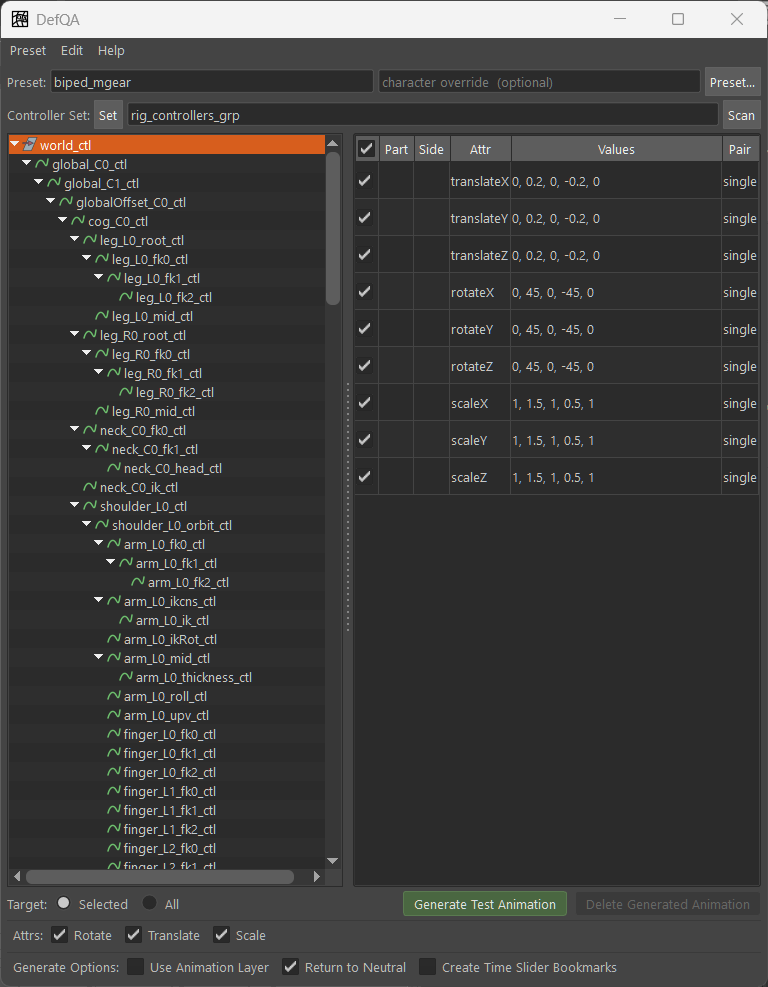

<p align="center">
  
</p>

# defQA

[日本語版](README.ja.md)

An automatic check animation generation tool for visually reviewing character rig skinning, range of motion, and rig behavior in Maya.




## Description

defQA collects transform nodes from a Controller Set and automatically generates test animation for keyable TRS attributes. For each attribute, it sets a `neutral -> positive value -> neutral -> negative value -> neutral` key sequence, offsetting generated frames per controller. Generated keys can be safely deleted based on metadata. Controller part classification and test values are managed with YAML presets.

## Installation

Install using either A or B.

### A.Maya module

1. Copy this repository to your Maya modules directory as `defQA`.

   - Windows: `%USERPROFILE%\Documents\maya\modules\defQA`
   - macOS: `~/Library/Preferences/Autodesk/maya/modules/defQA`
   - Linux: `~/maya/modules/defQA`

2. Copy `defQA.mod` from the repository to the same `modules` directory (next to the `defQA` folder).

3. Restart Maya.

After restart, `import def_qa` is available without changing `sys.path`.

### B.Drag and drop

Place the repository anywhere, then drag `drag-and-drop-install.mel` into the Maya viewport. A shelf button that launches defQA is added to the current shelf.

### Manual

Add the repository directory to your Python path and import the package.

```python
import sys
sys.path.insert(0, r"/path/to/defQA")

import def_qa
def_qa.showUI()
```

## Dependencies

### Python packages

| Package | Required | Notes |
| --- | --- | --- |
| **PyYAML** | Yes | Bundled in `def_qa/vendor/`. A system-installed package is used when available. |
| **Qt.py** | Yes (for GUI) | Bundled in `def_qa/vendor/`. A system-installed package is used when available. |


## Usage

### GUI

```python
import def_qa
def_qa.showUI()
```

### Script

```python
import def_qa

# Generate with default settings, targeting all keyable rotate/translate attributes
def_qa.generate("controllers_set")

# Use the mGear biped preset
def_qa.generate("controllers_set", preset_name="biped_mgear")

# Override options
def_qa.generate("controllers_set", preset_name="biped_common", start_frame=101, default_span=10)

# Delete generated keys
def_qa.delete()

# List available presets
print(def_qa.list_presets())
```

## Presets

YAML files define controller patterns and test values for each body part.

```yaml
template: biped_mgear
timeline:
  start_frame: 1
  default_span: 8
  gap_frame: 4
  part_gap_frame: 10
  return_to_neutral: true
options:
  enable_translate: true
  enable_rotate: true
  enable_scale: false
parts:
  spine:
    patterns:
      - "*spine_C*_ctl"
    tests:
      rotateX:
        values: [0, 30, 0, -30, 0]
        span: 8
```

Custom presets are placed in `def_qa/presets/`.
